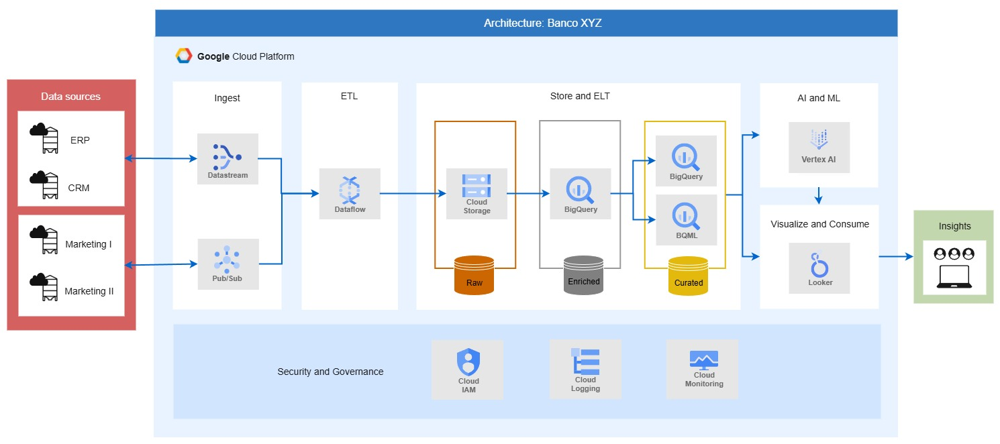
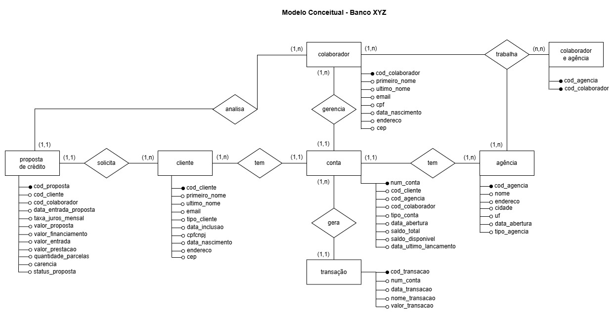

# Implementação de Lakehouse com Cloud Storage e BigQuery

Este projeto apresenta uma arquitetura data lakehouse end-to-end no GCP, integrando Cloud Storage e BigQuery para o setor bancário. Desenvolvido como um estudo de caso do Banco XYZ, o objetivo foi modernizar a plataforma de dados da instituição, visando escalabilidade e inteligência de negócio.

---

### Problema
O cenário original caracterizava-se pela fragmentação de dados em sistemas de ERP, CRM e plataformas de marketing, resultando em inconsistências numéricas e dependência de processos manuais baseados em planilhas. O objetivo central foi eliminar esses silos e estabelecer uma fonte única de verdade na nuvem, capaz de suportar o crescimento da base de clientes e habilitar análises preditivas confiáveis.

---

### Solução
A arquitetura proposta segue o padrão medallion, organizando os dados em camadas raw, enriched e curated:

 

 

O pipeline começa com uma ingestão híbrida para atender diferentes necessidades de latência. Utiliza-se o Datastream para capturar mudanças nos bancos transacionais (CDC) e o Pub/Sub para ingerir eventos de streaming das plataformas de marketing. O Dataflow executa os pipelines de processamento, unificando esses fluxos e escrevendo os dados brutos no Cloud Storage.
A estratégia de lakehouse se consolida na integração entre o Cloud Storage e o BigQuery. Enquanto o Storage armazena a camada raw, o BigQuery processa e armazena as camadas enriched e curated. Na etapa curated são aplicadas as regras de negócio e pode ser utilizado o BigQuery ML para a aplicação de modelos de machine learning diretamente no banco de dados.
Para a visualização e tomada de decisão, o Looker consome os dados da camada curated para a criação de dashboards. Paralelamente, o Vertex AI é utilizado para a aplicação de APIs de NLP em análises de dados não estruturados. Todo o ambiente é gerido com políticas de acesso via Cloud IAM e observabilidade com Cloud Logging e Monitoring.

 

 

O modelo conceitual acima estrutura os dados originalmente dispersos em planilhas do ERP. A intenção da modelagem é mapear as regras de negócio e garantir a consistência das informações para as análises.

---

### Conclusão
A implementação desta arquitetura transforma a cultura de dados do banco, migrando de processos manuais e isolados para uma gestão automatizada e inteligente. Além de garantir uma fonte única de verdade para a tomada de decisão, a solução oferece a elasticidade necessária para suportar o crescimento da instituição.
